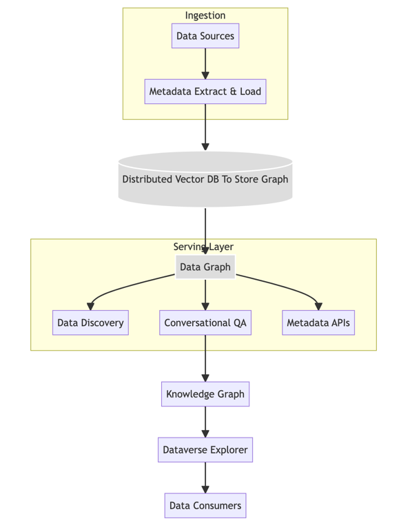
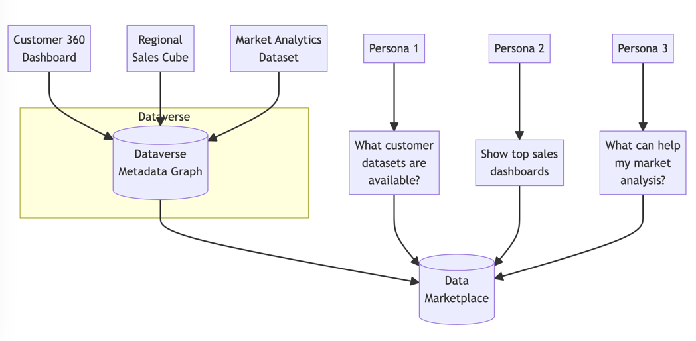

> **Disclaimer**: _The kingdom of Insightica, characters like chief architect Daedalus, and the storyline have been
added
> for color.They are fictional and do not refer to any actual organizations or people._
> _I aimed to turn what could have been a dry technical piece into a more narrative and fun read by adding some creative
fictional elements._

# The Dataverse: Unlocking the Power of Metadata

The data-driven Kingdom of Insightica faced a growing dilemma. Data was proliferating across siloed systems making it
arduous to find, understand, and harness datasets.

> **_As Gartner noted:_** "_Through 2022, 80% of data science projects will take six months longer than planned, largely
because of data access and data quality problems."_

To address this, Insightica's leaders commissioned the build of Dataverse - a metadata graph to map the kingdom's data
landscape.

_**Here is a short story explaining how the name "Dataverse" was inspired by the metaverse concept from Avengers:**_

When envisioning their grand metadata system, the kingdom's data masters were inspired by the Marvel metaverse. They
imagined creating an interconnected data landscape like in Avengers: Infinity War. "Imagine an immense graph linking
all our data assets the way the Marvel metaverse links story worlds," said chief architect Daedalus.
"A portal to navigate seamlessly across data sources."

The data masters were set on a name that evoked the Avengers metaverse. "Dataverse" was proposed, playing off the
similar sounding "metaverse."

The name clicked instantly. Dataverse perfectly captured their ambition - structuring the chaotic sprawl of siloed
data into an explorable metaverse-like web. Like Avengers heroes using portals to traverse the cinematic metaverse,
analysts could now seamlessly hop between datasets using Dataverse. Its metadata graph wove disconnected data silos
into a traversable Dataverse.

The data masters were thrilled that Dataverse conjured images of exploring a vast data metaverse, much like comic fans
imagined traversing Marvel's famed multiverse. Their own dataverse was coming to life.

## Engineering the Dataverse

Chief architect Daedalus outlined a design focused on flexibility, scale, and discovery:

For the graph storage as vector, they selected Milvus, an open source vector engine that scaled across nodes while
enabling
real-time analytics.

As the lead architect argued: "Milvus' hybrid storage layers optimize query performance and ingest. Its vectorSimilarity
search allows embedding graph metadata for more intelligent recommendations."

Milvus was deployed on Kubernetes with hydraulic sharding to handle growing data volumes. Prometheus monitored data
pipelines and graph workloads.

To make Dataverse intuitive, conversational QA was added using natural language AI. Knowledge graphs enhanced semantic
recommendations.

Dataverse connects metadata using two key technologies:

👉Vector database - Milvus vector indexes to enable semantic similarity search across metadata, regardless of schema.

👉Large language models - ChatGPT API powers a conversational interface to metadata.

### The Power of Vectors + AI

This combination unlocks capabilities that breathe new life into metadata:

👉Universal search - Queries based on meaning, not schemas

👉Recommendations - Proactively suggest related metadata

👉Conversational - Human-like dialog with metadata

👉Auto-generated - Use AI to create metadata from raw data

Metadata evolves from disconnected descriptions into an integrated knowledge layer.

### Core Capabilities

_Dataverse provided:_

👉Flexible metadata ingestion from diverse sources

👉A distributed graph/vector database for complex metadata modeling

👉Powerful search and browse across entity attributes and relationships

👉Conversational QA via LLM like ChatGPT, to query metadata using natural language

👉REST APIs to embed metadata in apps and workflows

👉Lineage tracking of data from sources downstream through transformation

👉Governance of security, compliance, risk, SLAs, and data quality

In Dataverse, metadata from diverse sources is flattened, embedded into float vectors using SentenceTransformers and
indexed in Milvus. The vector encodes the semantic meaning of the metadata.

On top of this vector foundation, Dataverse builds a conversational interface using ChatGPT. Users can have natural
language dialogs directly with the metadata, spanning sources and schemas.

Some example queries:

👉 "Show me metadata related to customer 360 that can help with churn analysis"

👉 "What datasets would be good for training a product recommender model?"

👉 "Which columns in the sales database relate to customer location?"

Dataverse returns relevant results extracted from metadata in conversational form.

### The Business Impact of Dataverse

For Insightica's data teams, Dataverse supercharged:

👉 Accelerated discovery: Intuitive search and conversational QA reduced data hunting time by over 50%

👉Deeper insights: Rich metadata provided critically missing context on data meaning, quality, and freshness

👉Informed governance: Holistic visibility enabled proactive governance to reduce risk

👉Productivity: Self-service access removed reliance on overwhelmed data stewards, improving analyst productivity

By connecting metadata using vectors and LLMs, Dataverse delivers tangible business value:

👉Accelerate analytics - Rapidly find relevant data for analysis

👉Increase productivity - Less time spent on metadata tasks

👉Minimize silos - Consistent view across metadata schemas

👉Enhance governance - Improve visibility and control over data

👉Democratize access - Intuitive access for business users (less technical)

👉Higher ROI - Maximize returns on metadata investments

### Enabling a Discoverable Data Marketplace

Beyond metadata, Dataverse allowed Insightica to create an online marketplace where data teams could publish consumable
data products for others to easily find and use.

Data producers could register datasets enhanced with rich metadata describing business definitions, quality, SLAs,
access needs, and usage examples.

Consumers could then easily discover these published data products by asking questions like:

1. [x] "What customer datasets are available to me?"
2. [x] "Show me the highest rated sales dashboards."
3. [x] "Which datasets can help me analyze market share?"

Dataverse would match the questions to relevant registered data products and display them in the marketplace. Users
could view metadata, sample the data, and subscribe to access the products that met their needs.

Below is a mockup of the discoverable data product marketplace enabled by Dataverse:

As Daedalus concluded: "Dataverse illuminates our data ecosystem like never before - enabling knowledge, trust, and
action."

And so Dataverse transformed Insightica's data landscape. Analysts rapidly navigated datasets while collaborating
effectively. The kingdom rejoiced at how Dataverse unlocked the power of metadata.

This data product marketplace enabled self-service data discovery, sharing, and collaboration at scale - accelerating
innovation and analytics across the kingdom.

### Enriching Metadata with Knowledge Graphs

To further enhance metadata, Dataverse utilized knowledge graphs to auto-generate additional descriptive tags and
classifications.

"By incorporating a product ontology and tagging datasets, we can auto-classify them into a rich knowledge graph,"
explained lead data scientist.

This allowed Dataverse to enrich metadata by applying ontology-based tags. The tags enabled powerful faceted search
and recommendations.

For example, a sales dataset tagged with the region "North America" would automatically get additional tags like
"NA Sales" from the ontology. This provided more semantic context for discovery.

When new datasets were ingested, Dataverse would analyze column names and sample data to derive applicable ontology
tags. These semantic tags were added to the metadata graph.

This enabled users to not only search by datasets names, but also by intuitive ontology-based tags.

_**Questions** like "Show me all customer data" could now return tagged results for "NA Shoppers Dataset" and
"Loyalty Metrics" even if the terms didn't match dataset names._

The knowledge graph enrichment reduced manual tagging and enabled powerful semantic search for better discovery.
Users could navigate the dataverse using intuitive domain concepts powered by the ontology.

Dataverse's knowledge graphs illuminated insights into the meaning and relationships between data assets - creating a
truly intelligent metadata platform.

### Implementing Hybrid Search

To make search results more intelligent and relevant, Dataverse utilized a hybrid approach combining vector similarity
and JSON search.

"Vector search better captures semantic context while JSON search allows filtering on specific attributes"

In Dataverse's metadata graph, key textual fields like dataset descriptions and business definitions along with auto
inferred ontology/knowledge graph as JSON-ld, these are indexed as dense vectors using Milvus.

This allowed matching datasets based on vector similarity - enabling semantic search so results "feel" more relevant
even if keywords don't fully match.

Additionally, structured metadata fields were indexed in JSON documents. This enabled filtering and sorting on
attributes like data owner, SLA, region etc.

When users searched Dataverse, the query was processed in parallel:

Vector similarity identified semantically relevant datasets based on text fields JSON search filtered and ranked results
by structured attributes. The hybrid approach blended semantic and structured search to return the most relevant
datasets personalized to the user
context.

"By combining vector and JSON search, we provide the best of both world,". "Relevant vector results refined by tuning on
structured metadata."

This hybrid architecture enabled Dataverse to deliver intelligent, contextual search - crucial for exploring the vast
Dataverse. Users found the precise data assets they needed, faster.

Power of Vectors + Language Models
This combination unlocks new metadata experiences:

👉Universal metadata search - Queries based on semantic meaning, not schemas

👉Metadata recommendations - Proactively suggest related metadata assets

👉Conversational interface - Natural language dialog with metadata

👉Auto-generated metadata - Use LLMs to produce metadata from unstructured data

Dataverse evolves metadata from passive descriptions into an active knowledge layer. Metadata becomes integral to data
processes like discovery, compliance, ML and analytics.

### Integrations Enable Broad Metadata Access

A pivotal decision was making Dataverse schema-less by representing metadata as a graph database rather than traditional
rigid tables.

"Schema-less graph metadata unlocks tremendous flexibility compared to RDBMS models," explained chief architect
Daedalus.

With table-based systems, adding attributes requires schema migrations - an arduous process stalling agility.
Dataverse's graph removed this friction by fluidly onboarding new nodes/relationships, enabling organic metadata
expansion.

The schema-less openness allowed absorbing metadata from disparate sources without force-fitting into predefined
schemas. This accelerated ingestion from across Insightica's diverse data systems.

However, flexibility did not mean losing structure or analytical capabilities. Dataverse leveraged techniques like
knowledge graphs, statistical models, and vector embeddings to enrich unstructured metadata with implicit structure.

This empowered insights into data quality, usage, lineage across the graph - without needing rigid schemas. Knowledge
graphs also added logical semantics to enable complex queries and recommendations.

As Daedalus summarized: "Dataverse proves schema-less metadata can pair with powerful analytics.
We tamed the complexity without compromising insights."

By blending schema-less ingestion with embedded structure, Dataverse unlocked rapid, extensible metadata absorption
from many systems while still deriving value and intelligence.

This paradigm shift accelerated Dataverse's impact. Without schema constraints, it could represent Insightica's
evolving data landscape in a rich, flexible way - providing a living map of the Dataverse.

### The Dataverse Transforms Insightica

In summary, Dataverse delivered tremendous value across Insightica's data landscape:

👉Flexible schema-less metadata from diverse systems was rapidly absorbed via graph database and APIs

👉Embedded structure like knowledge graphs and vector search enabled powerful analytics despite lack of rigid schemas

👉Intuitive search and conversational QA accelerated discovery and unlocked insights from metadata

👉Auto-generated tags and lineage maps provided missing context on data meaning, quality, and usage

👉Integrations with surrounding data systems enabled comprehensive data environment visibility

👉Self-service marketplace allowed publishing consumable data products for easy discovery and collaboration

**_As Daedalus concluded: "Dataverse illuminates our data ecosystem like never before."_**

By connecting siloed data systems into an integrated Dataverse map, Dataverse transformed how Insightica organizations
understood, trusted, and leveraged data.

Problems like disconnected datasets, opaque systems, and fragmented knowledge were superseded by enterprise-wide data
visibility.

Through its robust architecture and thoughtful design, Dataverse unlocked the power of metadata at scale for Insightica.
It became the lifeblood enabling data democratization and frictionless analytics across the kingdom.

### Linkedin Post

The Marvel Cinematic Metaverse inspires the World's most Connected Dataverse

Imagine an immense knowledge graph linking enterprise data assets the way the Marvel multiverse links story worlds. A
gateway to seamlessly traverse siloed sources.

This was our vision for Dataverse - a metadata platform unlocking insights across fragmented data systems.

Built on an open, distributed vector database, Dataverse absorbs schema-less metadata at scale via REST APIs. Knowledge
graphs and vector semantics embed structure to enable powerful analytics on flexible data.

Like superheroes using gateways to explore the Marvel metaverse, Dataverse allows analysts to rapidly navigate datasets
using conversational AI and semantic search. Its graph weaves siloed data into an integrated Dataverse.

🦸‍♂️ Ingests metadata from diverse sources without rigid schemas

🦸‍♂️ Vector similarity matches datasets by meaning, not just keywords

🦸‍♂️ Knowledge graphs auto-tag assets to enhance discoverability

🦸‍♂️ Generates 360-degree lineage between data processes

🦸‍♂️ Recommends related data products driven by ML algorithms

🦸‍♂️ Allows self-service publishing of consumable data assets

🦸‍♂️ Enables data discovery via natural language conversational UI

Dataverse illuminates the data ecosystem like never before - enabling knowledge, trust, and action.

👉 Watch a  below to see Dataverse in action!

👉 Check out the link below for more in-depth details on Dataverse's technical architecture and capabilities.

We built Dataverse to transform how organizations understand, connect, and leverage data. Like Marvel's metaverse
empowers its superheroes, Dataverse aims to unlock the collective power of enterprise data.
